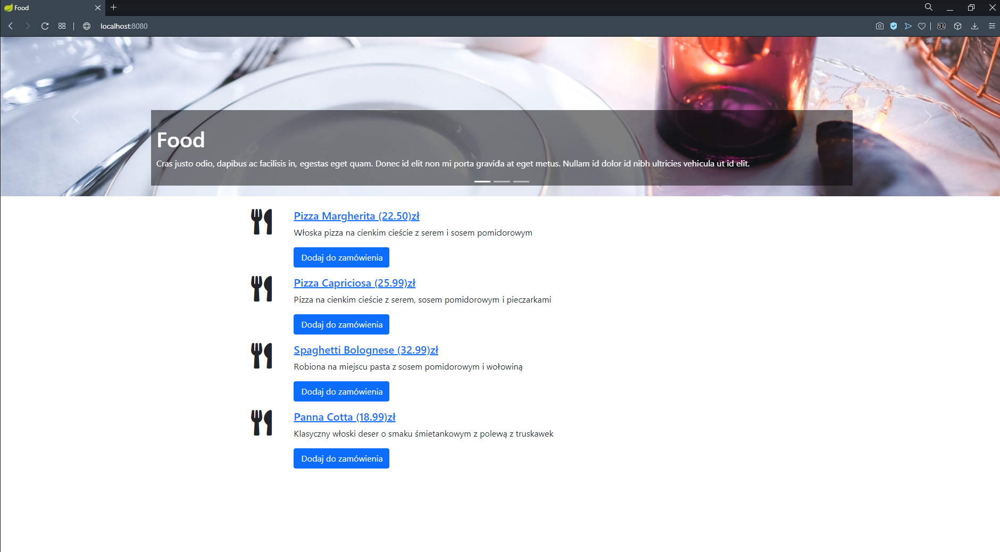
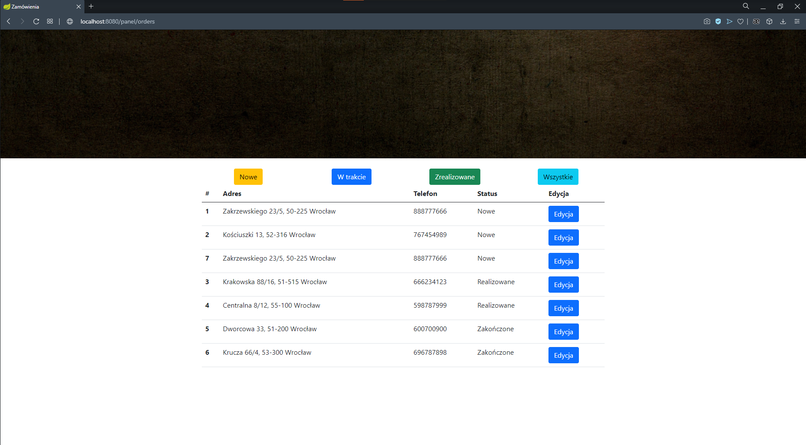

# Spring Boot Food Restaurant
This program is web application for order food. We can order food and manage orders. The application is built on Spring Boot and database is PostgreSQL.

## Table of contents
* [Technologies](#technologies)
* [Features](#features)
* [Sources](#sources)

## Technologies
Project is created with:

* Java 11
* Spring Boot 2.4.1
* Spring/Bean Validation
* Spring Data
* Spring MVC  
* PostgreSQL

## Features

* order products
* manage orders `localhost:8080/panel/orders`
    * edit status order
    * filtration orders by status

## Sources
This app is based on tutorial from [JavaStart](https://javastart.pl)